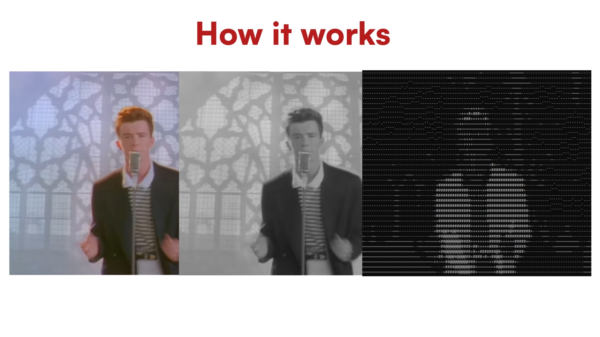

## Real Time ASCII video converter

### Demo
https://user-images.githubusercontent.com/80504466/179368698-8be66942-475a-4ede-8394-251b4ac9a9f9.mp4
* This Demo was shot live (No Arjuns were harmed while recording)

### How it Works

1. It takes input from your webcam and outputs a frame
2. Converts the coloured frame to greyscale
3. The Pixels are reassigned a character
4. Then the characters are joined in a string
5. Output is printed to the Terminal

### The Illusion of Video.

The output it creates isn't actually a rendered video. As soon as the string is printed 
to the terminal it is also cleared from the terminal immediately and a new frame is printed
simultaneously, Thus Creating the illusion of a video.
